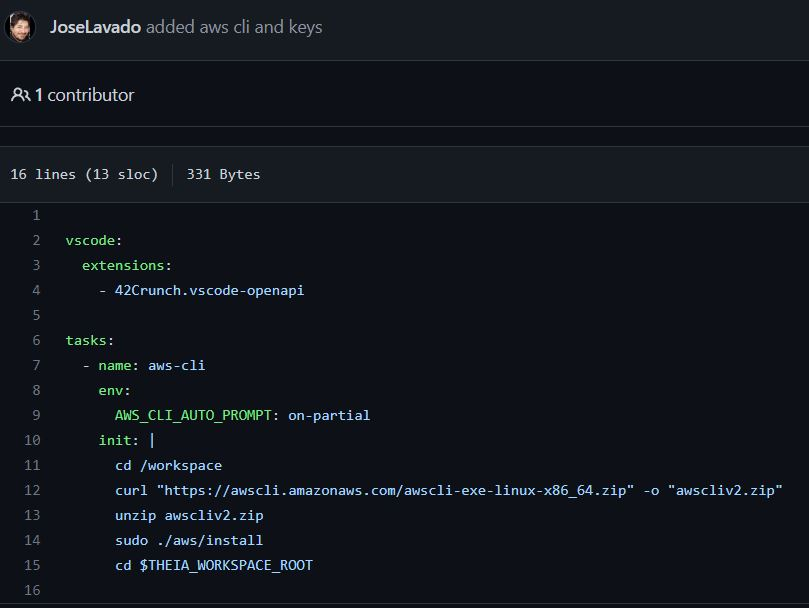
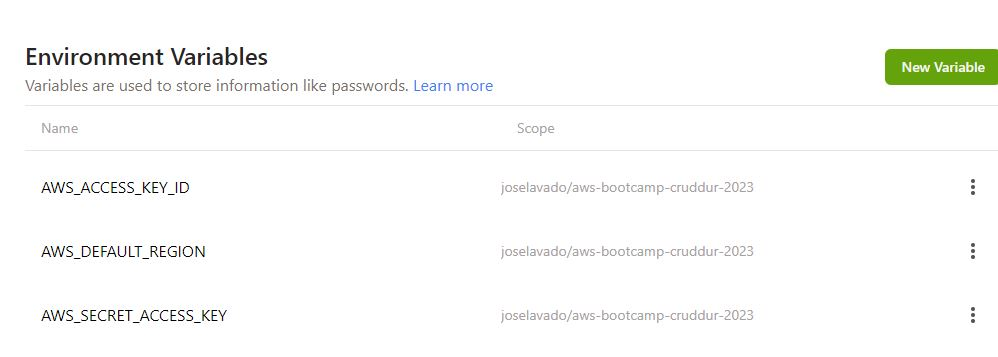

# Week 0 — Billing and Architecture
Student portal: https://student.cloudprojectbootcamp.com/users/sign_in

## Required Homework

### Install AWS CLI

I installed the AWS cli in Gitpod via the TASKS commands on the gitpod yaml file according to the instructions

I also save the ENV variables in Gitpod

Steps cmpleted: 
1) Started by creating a free AWS account and then registering a new DNS name: napstablook.net  
  a) setup MFA for root account 
3) I had a GitHub account so I just copied the template from the Bootcamp repository: aws-bootcamp-cruddur-2023  
4) Created GitPod account  
5) Created Lucid chart free account to do napkin design according to Week 0 homework  
6) Working on Lucid chart: https://lucid.app/lucidchart/45e711c9-e679-4ae1-9faf-946f5e21da52/edit?viewport_loc=-11%2C-124%2C2219%2C956%2C0_0&invitationId=inv_7d43a971-3673-40d1-82a8-abd06f86131c
