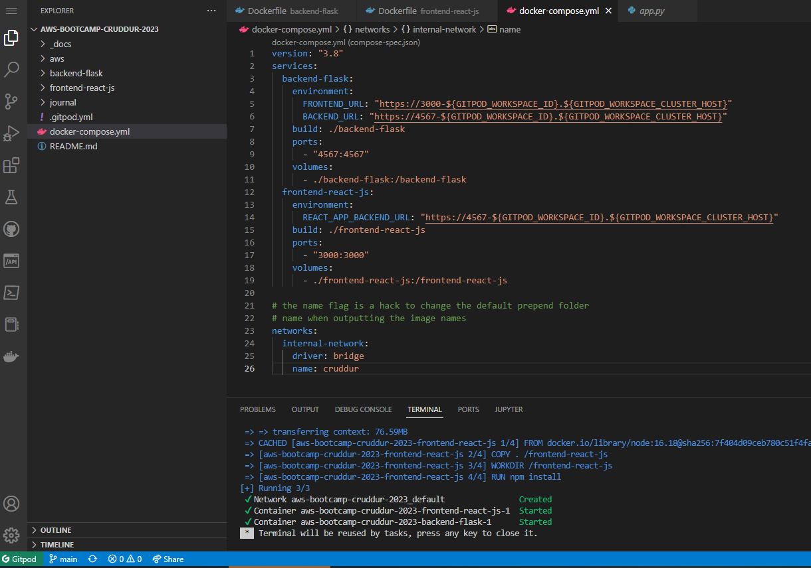

# Week 1 — App Containerization

## Homework challenges 

### I was able to run the application

### I was able to follow the video and run docker compose

### Push and tag a image to DockerHub (they have a free tier)

### Launc EC2 and run containers from there:

### Push and tag a image to DockerHub from MY PC:

